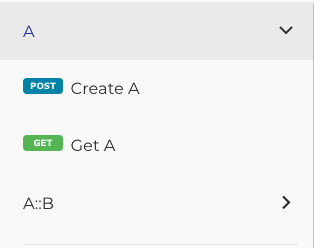
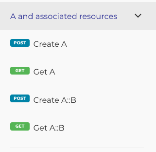

# Sections

Normally Reslang will present each resource, in order, as its own separate tag. This tends to look orderly, but is not necessarily optimal as a way to explain an API.

E.g. This definition:

    "This is resource A"
    resource A {
        id: uuid
        /operations
            GET POST
    }

    "This is resource B"
    subresource A::B {
        id: uuid
        /operations
            GET POST
    }

will produce the following redoc view - basically the 2 resources in order.

We can customize this and group in any way required using the section keyword.

E.g.

        "This is all about A and A::B, they are related resources..."
        section A and associated resources {
            /include
                A A::B
        }

produces a more streamlined view:

Note that you can have as many sections as you want, but each resource must be included in only 1 section. Also note that if a resource is not included in any section definition, Reslang will give it its own toplevel tag, as per the default.
